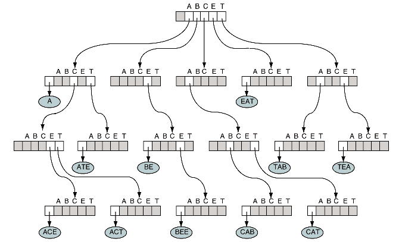
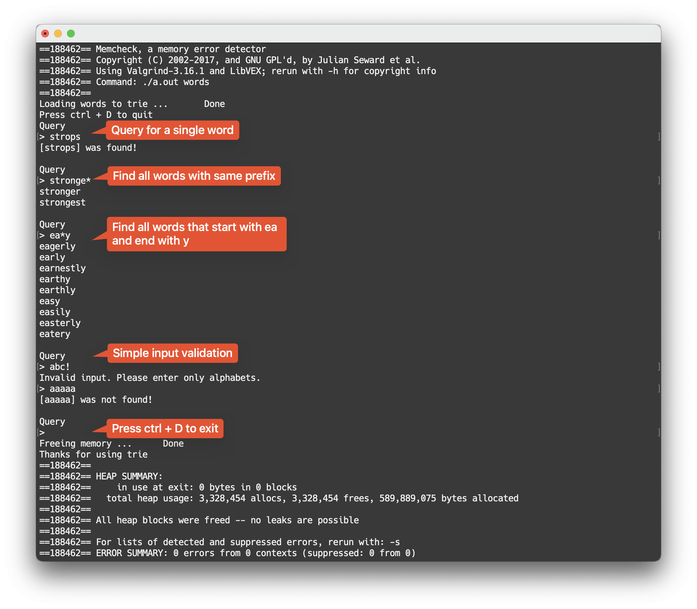

## 📕Trie

A Trie program used to word query implemented by C.

The program reads the file, and insert words to trie. Therefore, the filename of input should be provided when running the program.

Syntax.

* Input a word directly, the program returns whether it was found or not.
* Input "ab*", the program returns all words with prefix "ab".
* Input "*ab", the program returns all words with suffix "ab".
* Input "a*b", the program returns all words that has the prefix "a" and the suffix "b".

The program releases all memory when it exits.

### How to run

1. Clone: `git clone https://github.com/Avafly/TrieDictionary.git`
2. Compile: `make`
3. Run: `./main words`

### What is trie

Trie is a tree-like data structure used for efficient retrieval of key-value pairs where the key is a string. With a Trie, certain operations can be faster than with other kinds of data structures like Binary Search Trees or Hash Tables. Each node of a Trie can contain multiple children, typically represented as an array or a dictionary. Each edge between nodes in the Trie represents a character of a word. By following a path from the root to a node, we can form a word. The size of the children array or dictionary depends on the character set the Trie is storing. Tries are typically used for searching words in a dictionary, providing auto suggestions in search engines, and even IP routing in networking. The advantage of a Trie is that it can check if a word or prefix exists in a dataset very efficiently.



### Data Structure

```c++
/* TRIE structure deifinition */
typedef struct TrieNode {
    char *entry;
    struct TrieNode *subtrees[MAXSIZE];
} TRIE;
```

### Demo



